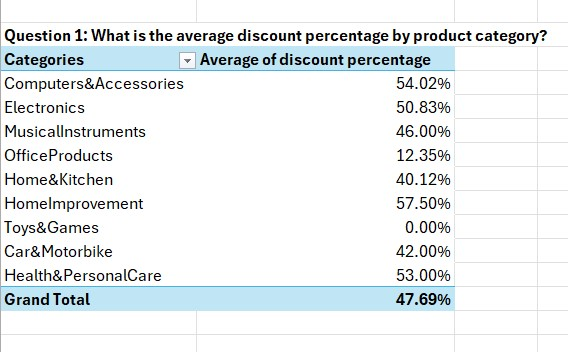
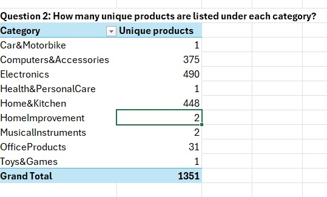
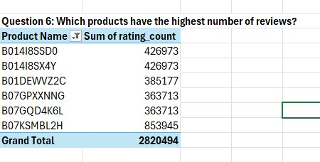
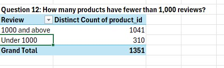

# 📊 Amazon Product Review Analysis Project

## 📝 Project Overview

This project focuses on **cleaning, transforming, and analyzing** a dataset of product listings and their associated customer reviews from the Amazon e-commerce platform. Using **Microsoft Excel** and **Power Query**, the data was restructured to support effective insights via **Pivot Tables** and **Dashboard Visualization**.

---

## 🎯 Objectives

The analysis answers the following key business questions:

1. What is the **average discount percentage** by product category?
2. How many **products are listed** under each category?
3. What is the **total number of reviews** per category?
4. Which products have the **highest average ratings**?
5. What is the **average actual price vs. discounted price** by category?
6. Which products have the **highest number of reviews**?
7. How many products have a **discount of 50% or more**?
8. What is the **distribution of product ratings** (e.g., how many products are rated 3.0, 4.0, etc.)?
9. What is the **total potential revenue** (`actual_price × rating_count`) by category?
10. What is the **number of unique products** per price range bucket (e.g., <$200, $200–$500, >$500)?
11. How does the **rating relate to the level of discount**?
12. How many products have **fewer than 1,000 reviews**?
13. Which categories have products with the **highest discounts**?
14. Identify the **top 5 products** in terms of **rating and number of reviews combined**.

---

## 📂 File Structure and Sheet Descriptions

```
📁 ProductReviewAnalysis/
├── 📄 README.md                  # This project documentation
├── 📊 Amazon_product_analysis.xlsx       # Main workbook with cleaned data, pivot tables, and dashboard
│
├── 📑 Sheets inside the workbook:
│   ├── amazon                   #Original amazon dataset
│   ├── sorted                   # cleaned product-review table from Power Query. csv were split into multiple columns
                                   using power query 
│   ├── product                  # Product information (Product ID as primary key)
│   ├── review                   # Review breakdown (Product ID as foreign key)
│   ├── Q1–Q14                   # Each sheet has pivot tables/analysis for each question
│   └── dashboard                # Combined visual presentation of insights using Pivot Charts
```

## Interactive dashboard

🧠 Business Question Analysis (Q1–Q14)
<details> <summary><strong>Q1. What is the average discount percentage by product category?</strong></summary> <p align="center">  </p> </details> <details> <summary><strong>Q2. How many products are listed under each category?</strong></summary> <p align="center">  </p> </details> <details> <summary><strong>Q3. What is the total number of reviews per category?</strong></summary> <p align="center">  </p> </details> <details> <summary><strong>Q4. Which products have the highest average ratings?</strong></summary> <p align="center">  </p> </details> <details> <summary><strong>Q5. What is the average actual price vs. discounted price by category?</strong></summary> <p align="center">  </p> </details> <details> <summary><strong>Q6. Which products have the highest number of reviews?</strong></summary> <p align="center">  </p> </details> <details> <summary><strong>Q7. How many products have a discount of 50% or more?</strong></summary> <p align="center">  </p> </details> <details> <summary><strong>Q8. What is the distribution of product ratings?</strong></summary> <p align="center">  </p> </details> <details> <summary><strong>Q9. What is the total potential revenue by category?</strong></summary> <p align="center">  </p> </details> <details> <summary><strong>Q10. What is the number of unique products per price range bucket?</strong></summary> <p align="center">  </p> </details> <details> <summary><strong>Q11. How does the rating relate to the level of discount?</strong></summary> <p align="center">  </p> </details> <details> <summary><strong>Q12. How many products have fewer than 1,000 reviews?</strong></summary> <p align="center">  </p> </details> <details> <summary><strong>Q13. Which categories have products with the highest discounts?</strong></summary> <p align="center">  </p> </details> <details> <summary><strong>Q14. Top 5 products in terms of rating and number of reviews combined?</strong></summary> <p align="center">  </p> </details>

---

## 🛠 Tools & Techniques Used

- **Power Query**: Data transformation (split, clean, unpivot, zip, expand, join)
- **Excel Pivot Tables**: Aggregations, distinct counts, averages, sums
- **Excel Pivot Charts**: Column, Pie, Bar and Scatter plots
- **Calculated Columns**: Used for bucket creation, combined scores and conditional flags

---

## 👏 Acknowledgements

Special thanks to:

- **Digital Skills Africa** – for providing the upskilling opportunity and curriculum.  
- **Incubator Hub** – for guidance, mentorship, and technical support throughout the project.

---

## 👨‍💻 Author

**Ephraim Elakhe**  
📧 Email: elakhe.ephraim.9@gmail.com  
🔗 LinkedIn: *https://www.linkedin.com/in/ephraimelakhe/*  
