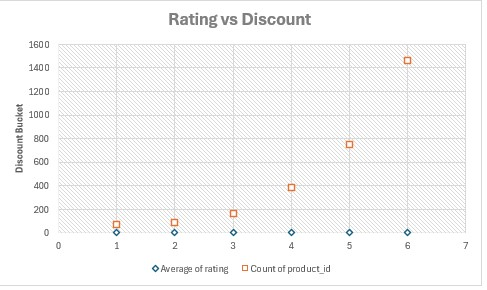

##🧠 Business Question Analysis (Q1–Q14)

 
<strong>Q1. What is the average discount percentage by product category?</strong>
 
  
 
 
 
<strong>Q2. How many products are listed under each category?</strong>
 
  
 
 
 
<strong>Q3. What is the total number of reviews per category?</strong>
 
  
 
 
 
<strong>Q4. Which products have the highest average ratings?</strong>
 
  
 
 
 
<strong>Q5. What is the average actual price vs. discounted price by category?</strong>
 
  
 
 
 
<strong>Q6. Which products have the highest number of reviews?</strong>
 
  
 
 
 
<strong>Q7. How many products have a discount of 50% or more?</strong>
 
  
 
 
 
<strong>Q8. What is the distribution of product ratings?</strong>
 
  
 
 
 
<strong>Q9. What is the total potential revenue by category?</strong>
 
  
 
 
 
<strong>Q10. What is the number of unique products per price range bucket?</strong>
 
  
 
 
 
<strong>Q11. How does the rating relate to the level of discount?</strong>
 
  
 
 
 
<strong>Q12. How many products have fewer than 1,000 reviews?</strong>
 
  
 
 
 
<strong>Q13. Which categories have products with the highest discounts?</strong>
 
  
 
 
 
<strong>Q14. Top 5 products in terms of rating and number of reviews combined?</strong>
 
  
 

##📈Key Visual Insights

| Insight                                 | Visualization                                               |
| --------------------------------------- | ----------------------------------------------------------- |
| Average Discount by Category            |                    |
| Number of Products by Category          |              |
| Total Reviews by Category               |                   |
| Top 5 Rated Products                    |                     |
| Most Reviewed Products                  |                      |
| Discount ≥ 50%                          |  |
| Price Comparison (Actual vs Discounted) |      |
| Rating Distribution                     |                         |
| Revenue Potential                       |               |
| Ratings vs Discounts                    |                          |
| Products ≥ 1000 Reviews                 |          |
| Price Ranges                            |                        |
| Top 5 Combined Score Products           |             |
| Highest Discount Categories             |                |
